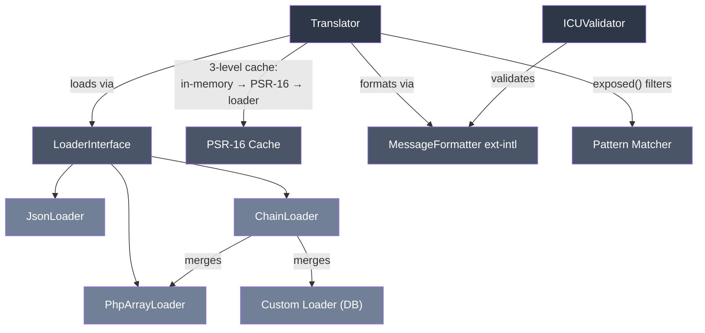

# phpdot/i18n

Internationalization with ICU MessageFormat, pluggable loaders, PSR-16 caching. Standalone.

## Install

```bash
composer require phpdot/i18n
```

## Architecture



## How It Works

### Translation flow

```
translate('messages.welcome', ['name' => 'Omar'])
    │
    ├── 1. Load translations for current language
    │       ├── In-memory array (per-request)     ← fastest
    │       ├── PSR-16 cache (Redis/File/APCu)    ← shared across requests
    │       └── Loader (PHP files/JSON/DB chain)  ← cold start only
    │
    ├── 2. Look up key in current language
    │       └── If missing → fall back to default language
    │           └── If still missing → return [key], track in getMissing()
    │
    ├── 3. Auto-inject _locale_, _region_, _lang_ into params
    │
    └── 4. Format via ICU MessageFormatter (ext-intl)
            └── Plurals, select, dates, numbers, currency — all handled
```

### Caching

Translations are cached per language. Three levels:

1. **In-memory array** — avoids repeated cache reads within a single request/worker
2. **PSR-16 cache** — any backend (Redis, File, APCu via phpdot/cache or any PSR-16 implementation)
3. **Loader** — reads files/DB only on cold start or after `clearCache()`

Cache key format: `i18n.{language}` (e.g. `i18n.en`, `i18n.ar`).

```php
// Admin changes a translation → clear cache → next request rebuilds
$translator->clearCache('ar');   // clear one language
$translator->clearCache();       // clear all languages
```

## Usage

### Basic

```php
use PHPdot\I18n\Translator;
use PHPdot\I18n\Loader\PhpArrayLoader;

$translator = new Translator(
    loader: new PhpArrayLoader('/app/lang'),
    cache: $cache,   // any PSR-16 implementation
    default: 'en',
    supported: ['en', 'ar', 'fr'],
);

$translator->setLocale('ar_JO');
echo $translator->translate('messages.welcome', ['name' => 'Omar']);
// → مرحباً Omar!
```

### Translation files

**PHP format** (`lang/en/messages.php`):
```php
return [
    'welcome' => 'Welcome, {name}!',
    'items' => '{count, plural, one {# item} other {# items}}',
];
```

**JSON format** (`lang/en/messages.json`):
```json
{
    "welcome": "Welcome, {name}!",
    "items": "{count, plural, one {# item} other {# items}}"
}
```

Keys are prefixed by filename: `messages.welcome`, `messages.items`.

### ICU MessageFormat

All translations use ICU MessageFormat — one syntax for everything:

```php
// Simple replacement
'Welcome, {name}!'

// Pluralization
'{count, plural, one {# item} other {# items}}'

// Gender/Select
'{gender, select, male {He} female {She} other {They}} liked this.'

// Regional variants (auto-injected _region_)
'{_region_, select, JO {رقم الموبايل} SA {رقم الجوال} other {رقم الهاتف}}'

// Number formatting
'{amount, number, currency}'

// Date formatting
'{date, date, long}'
```

### Auto-injected context

Every `translate()` call automatically injects:

| Param | Value | Example |
|-------|-------|---------|
| `_locale_` | Full locale | `ar_JO` |
| `_lang_` | Language code | `ar` |
| `_region_` | Region code | `JO` |

Use in ICU `select` for regional variants without separate files.

### Fallback

```
Current language → Default language → [key] placeholder
```

Missing keys are tracked via `getMissing()`.

### With DB overrides

```php
use PHPdot\I18n\Loader\ChainLoader;

$translator = new Translator(
    loader: new ChainLoader([
        new PhpArrayLoader('/app/lang'),  // file defaults
        new DbLoader($db, $tenantId),     // admin overrides (app-level)
    ]),
    cache: $cache,
    default: 'en',
    supported: ['en', 'ar'],
);
```

Last loader wins for duplicate keys. Admin saves a translation → validate with `ICUValidator` → upsert to DB → `clearCache()`.

## Frontend Exposure

`exposed()` returns raw ICU templates for frontend rendering via [intl-messageformat](https://www.npmjs.com/package/intl-messageformat).

### Pattern syntax

Patterns use dot-separated segments with wildcard support:

| Pattern | Matches | Doesn't match |
|---------|---------|---------------|
| `js.buttons` | `js.buttons` + all children | `js.errors.required` |
| `js.buttons.*` | `js.buttons.save`, `js.buttons.cancel` | `js.buttons.save.label` |
| `js.*.save` | `js.buttons.save`, `js.forms.save` | `js.save` |
| `*.welcome` | `messages.welcome` | `messages.goodbye` |
| `*.*.*` | all 3-segment keys | 2-segment keys |
| `js.**` | everything under `js.` at any depth | `messages.welcome` |
| `**` | all translations | — |

`*` matches exactly one segment. `**` matches one or more segments (recursive). No wildcard = prefix match (exact key + all children).

### Examples

```php
// Direct children of js.buttons
$translator->exposed(['js.buttons.*']);
// → ['js.buttons.save' => 'Save', 'js.buttons.cancel' => 'Cancel']

// All js translations at any depth
$translator->exposed(['js.**']);
// → ['js.buttons.save' => '...', 'js.buttons.cancel' => '...', 'js.errors.required' => '...']

// Wildcard in the middle
$translator->exposed(['js.*.save']);
// → ['js.buttons.save' => 'Save', 'js.forms.save' => 'Save']

// Mix patterns and exact prefixes
$translator->exposed(['messages.welcome', 'js.buttons.*']);
// → ['messages.welcome' => '...', 'js.buttons.save' => '...', 'js.buttons.cancel' => '...']

// Everything
$translator->exposed(['**']);
```

`exposed()` uses the same 3-level cache as `translate()` — translations are loaded once, then filtered in memory. Current language merged on top of default language (current wins for duplicate keys).

### Validating templates

```php
use PHPdot\I18n\ICUValidator;

$validator = new ICUValidator();

if (!$validator->isValid($template)) {
    $errors = $validator->validate($template);
    // ['Syntax error in ICU message pattern']
}
```

### Auditing missing translations

```php
$missing = $translator->getMissing();
// ['ar' => ['settings.notifications', 'errors.rate_limit']]
```

## Loaders

| Loader | Source | Format |
|--------|--------|--------|
| `PhpArrayLoader` | `lang/{language}/*.php` | PHP arrays |
| `JsonLoader` | `lang/{language}/*.json` | JSON files |
| `ChainLoader` | Multiple loaders | Merged (last wins) |
| Custom | Implement `LoaderInterface` | Any source |

`LoaderInterface` has one method: `loadAll(string $language): array<string, string>`. Returns a flat key → ICU template map.

## Requirements

- PHP >= 8.3
- ext-intl
- psr/simple-cache ^3.0

## License

MIT
